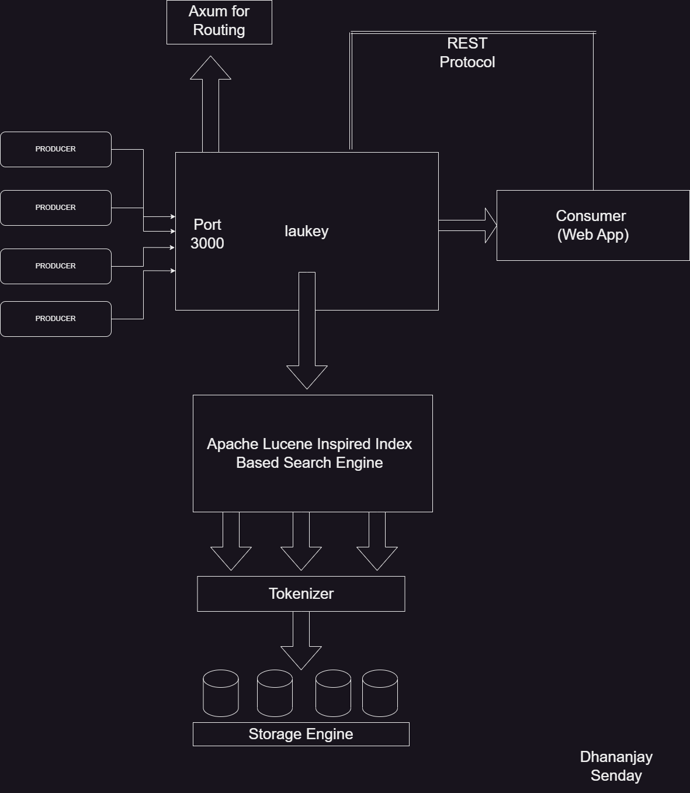

# Laukey - Log Ingestor Written in Rust
<hr/>

## Laukey Name / Design Decison are inspired from [Grafana Loki](https://github.com/grafana/loki) 



### Program Overview
<hr/>
<ul>
<li>
Axum Hanldes Routing Logic , Any Response That Hits Port 3000 in desired Format gets Stored It

</li>
<li>
Axum Passes the Response to Lucene Based Full Text Search Engine
<b>The Important point to Note that Inverted Index Based Engine are Used for Text Search 
As They Are Optimised for Text Search better than Any Database The are used in Other Solutions like Elastic Search , Grafana Loki , FLuentD
</b>
</li>
<li>After Inputs are Processed They are ready to query</li>
</ul>

### Build Steps
<hr/>
<ul>
<li>Rust Compiler is Required as The Project is Based on Rust</li>
<li>TO Compile Type cargo build</li>
<li>To Run type cargo run</li>
</ul>


### Log Format
<hr/>

```json
{
	"level": "error",
	"message": "Failed to connect to DB",
    "resourceId": "server-1234",
	"timestamp": "2023-09-15T08:00:00Z",
	"traceId": "abc-xyz-123",
    "spanId": "span-456",
    "commit": "5e5342f",
    "metadata": {
        "parentResourceId": "server-0987"
    }
}
```


### Injesting Data Into Program
<hr/>
curl can be used to injest data into system

```shell
curl --location 'http://localhost:3000' \
--header 'Content-Type: application/json' \
--data '{
    "level": "debug",
    "message": "Failed to connect to Internet",
    "resourceId": "server-345",
    "timestamp": "2023-10-15T08:00:00Z",
    "traceId": "cdf-qwe-567",
    "spanId": "span-875",
    "commit": "5ejhfdyut",
    "metadata": {
        "parentResourceId": "server-6475"
    }
}'
```
### Query Data From System
To Query Data from System Use the URL Params to Specify Field to Perform Search
<br/>
```shell
curl --location 'http://localhost:3000/search?level=error&message=Failed%20to%20connect'
```

Available Params 
<ul>
<li>commit</li>
<li>level</li>
<li>message</li>
<li>parentResourceId</li>
<li>resourceId</li>
<li>spanId</li>
<li>traceId</li>
<li>timestamp</li>
</ul>
<mark>Important</mark>
<br/>
timestamp required INPUT to be in form <b>rfc3339</b>


©Dhananjay Senday (2023)